# Proyecto Compiladores

* Paolo Vásquez
* Marcelo Zuloeta
* Sandoval Rivera Jerimy

## Pregunta 1 (Comentarios de una línea)

Nos piden **Agregar la posibilidad de incluir comentarios de una sola línea en cualquier punto. Los comentarios deberán empezar con // y acabar con el fin de línea.**

Para realizar esta tarea, sólo modificaremos el ***Scanner*** (imp_parser.cpp):
<center>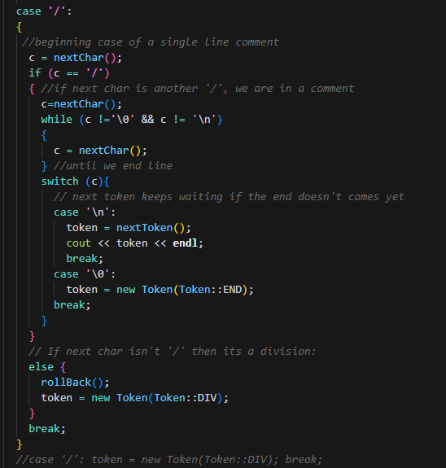</center>

Se nos indica expresamente que los comentarios son de una línea, por lo tanto deben terminar en un salto de línea '\n' o '\0'

Bajo la pregunta de:
> ¿Que cambios se hicieron al scanner y/o parser para lograr la inclusión de comentarios?

Podemos decir lo siguiente:
- Se modificó la función nextToken(), *modificando* el caso donde encuentra un '/'.
- Ahora lo que va a hacer es leer el siguiente carácter y guardarlo en c
- Va a preguntar si el siguiente c es igual a '/'. Si la respuesta es afirmativa, eso quiere decir que estamos en un comentario
  - Empezaremos a comer caracteres hasta no encontrar un '\0' o '\n'
  - Si se llega a un salto de línea, lo que se hará será hacer que el token guarde el siguiente llamado a la función.
  - Si se llega al final del documento se le asigna el Token::END al token 
- Si c es diferenta a '/' llamamos al ***rollback***, y retornamos un token de tipo DIV, que era el que estaba originalmente.

## Pregunta 02

### Codegen para constantes booleanas

```cpp
int ImpCodeGen::visit(BoolConstExp* e) {
  if (e->b == false) codegen(nolabel, "push", 0);
  else codegen(nolabel, "push",1);
}
```
Básicamente evaluamos el valor de la expresión. Si es falsa, pusheamos 0 a la pila; caso contrario, pusheamos 1.

### Operadores and/or en Binary Exp:

```cpp
int ImpCodeGen::visit(BinaryExp* e) {
  e->left->accept(this);
  e->right->accept(this);
  string op = "";
  switch(e->op) {
  case PLUS: op =  "add"; break;
  case MINUS: op = "sub"; break;
  case MULT:  op = "mul"; break;
  case DIV:  op = "div"; break;
  case LT:  op = "lt"; break;
  case LTEQ: op = "le"; break;
  case EQ:  op = "eq"; break;
  case OR: op = "or";break;
  case AND: op = "and"; break;
  default: cout << "binop " << Exp::binopToString(e->op) << " not implemented" << endl;
  }
  codegen(nolabel, op);
  return 0;
}
```

Sencillamente agregamos los casos para AND y OR, y de dicha manera se pueden emplear estos operadores.

### Codegen para bucle for

```cpp
int ImpCodeGen::visit(ForStatement *s)
{
    direcciones.add_level();
    int preloop = siguiente_direccion;

    direcciones.add_var(s->id, siguiente_direccion);
    siguiente_direccion++;

    s->e1->accept(this);
    codegen(nolabel, "store", direcciones.lookup(s->id));
    s->e2->accept(this);

    string begin = next_label();
    string body = next_label();
    string end = next_label();

    codegen(begin, "skip");
    codegen(nolabel, "dup");
    codegen(nolabel, "load", direcciones.lookup(s->id));
    codegen(nolabel, "ge");
    codegen(nolabel, "jmpn", body);

    codegen(nolabel, "goto", begin);
    codegen(body, "skip");

    s->body->accept(this);

    codegen(nolabel, "load", direcciones.lookup(s->id));
    codegen(nolabel, "push", 1);
    codegen(nolabel, "add");
    codegen(nolabel, "store", direcciones.lookup(s->id));
    codegen(nolabel, "goto", begin);

    codegen(end, "skip");
    codegen(nolabel, "pop");

    direcciones.remove_level();
    siguiente_direccion = preloop;

    return 0;
```
Tome un bucle for de la forma ```for(x = e1 ; x <= e2; x++) ```. Lo que hacemos es añadir un nuevo nivel de direcciones, donde seperamos un espacio para inicializar x, y luego asignarle el valor de e1. Luego evaluaremos e2, que mantendremos en la pila para realizar las verificaciones respectivas. El resto del codigo, hasta un poco antes del finales, sera la propia ejecución del bucle, que se vera en lenguaje de pila de la siguiente manera:

```
begin: skip
dup
load x
ge
jmpn body
goto end
body: skip
load x
push 1
add
store x
goto begin
end:skip
pop
```

Finalmente eliminamos dicho nivel de direcciones, y restauramos la dirección antes de ejecutar el for.
## Pregunta 3  (Sentencia do-while)

### Codegen para el do - while
Para generar el código del bucle do-while se utiliza una estructura similar a ...
```cpp
int ImpCodeGen::visit(do_WhileStatement* s){
  string l1 = next_label();
  string l2 = next_label();

  codegen(l1,"skip");
  s->body->accept(this);
  s->cond->accept(this);
  codegen(nolabel,"jmpz",l2);
  codegen(nolabel,"goto",l1);
  codegen(l2,"skip");

  return 0;
```

Ademas agregamos el metodo en la clase en el Impcodegen:
<center>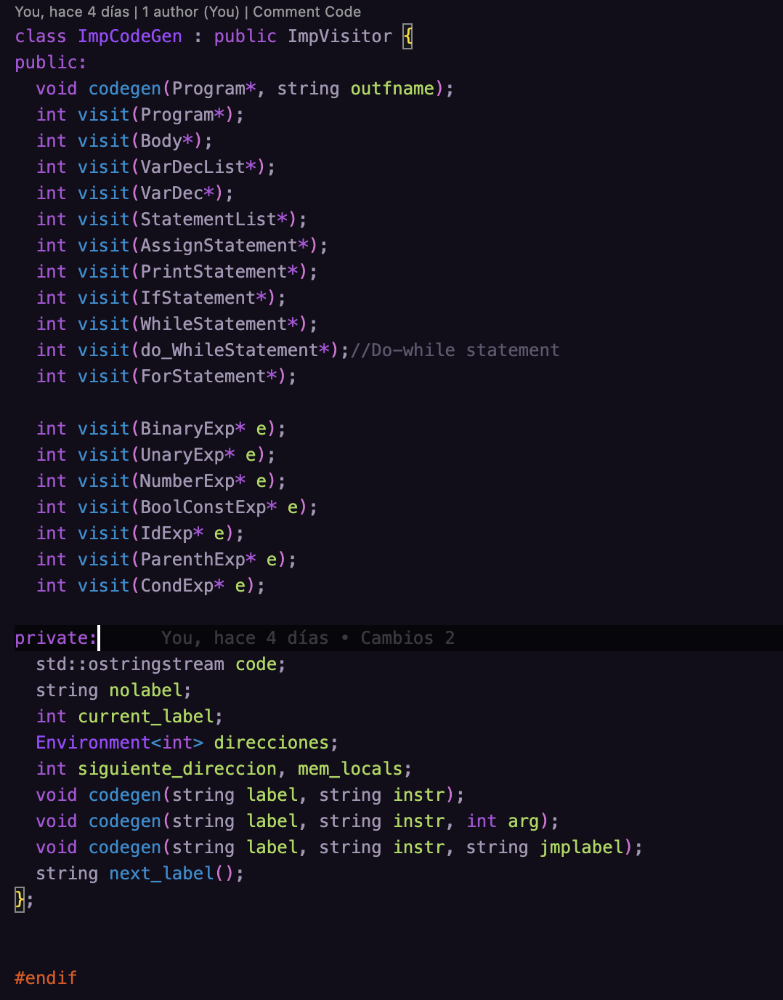</center>

Cambios en el interpreter, agregamos la sintaxis de funcionamiento de un do while de c++
```cpp
int ImpInterpreter::visit(do_WhileStatement* s)
{
  do
  {
    s->body->accept(this);
  } while (s->cond->accept(this));
  
  return 0;
};
```

Ademas agregamos el metodo en la clase en el ImpInterpreter:

<center>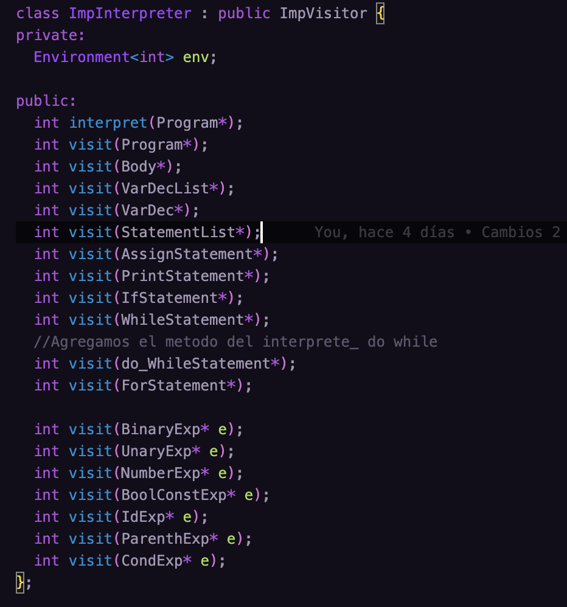</center>

Cambios en el parser para reconocer el do-while:

```cpp
else if (match(Token::WHILE)) {
    e = parseExp();
    if (!match(Token::DO))
      parserError("Esperaba 'do'");
    tb = parseBody();
    if (!match(Token::ENDWHILE))
	parserError("Esperaba 'endwhile'");
    s = new WhileStatement(e,tb);
  }

```

Agregamos el metodo en el printer para un do-while en imp_printer:
<center>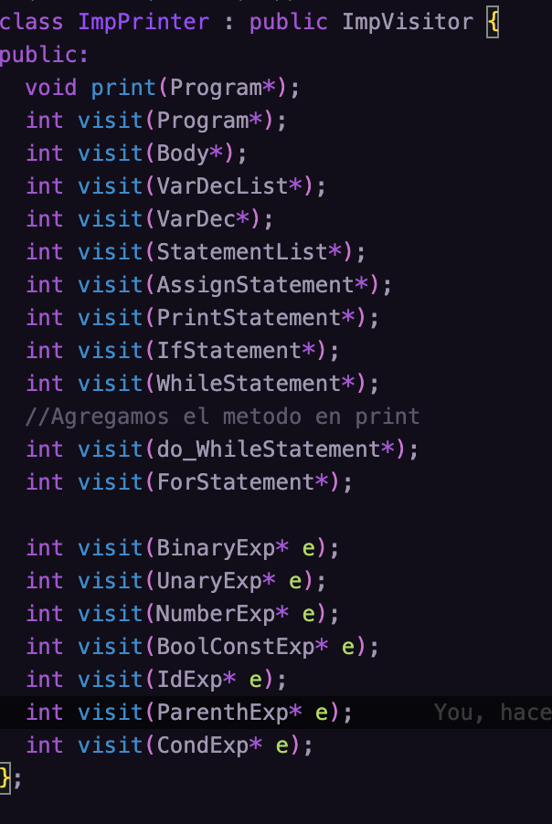</center>

```cpp
int ImpPrinter::visit(do_WhileStatement* s){
  cout << "do" << endl;
  s->body->accept(this);
  cout << "while";
  s->cond->accept(this);
  cout << endl;
  return 0;
}
```

En typechecker realizamos este cambio:

<center>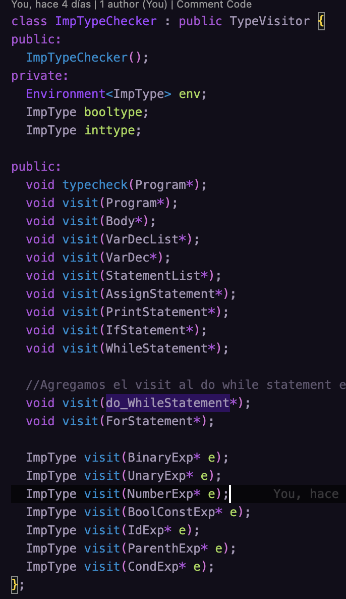</center>

```cpp
void ImpTypeChecker::visit(do_WhileStatement* s){
  s->body->accept(this); 
  ImpType etype = s->cond->accept(this);
  if (!etype.match(booltype)) {cout<<"Condicional debe ser do-while deberia ser bool"<<endl; exit(0);}
  return;
}
```
 En el visitor:
 <center>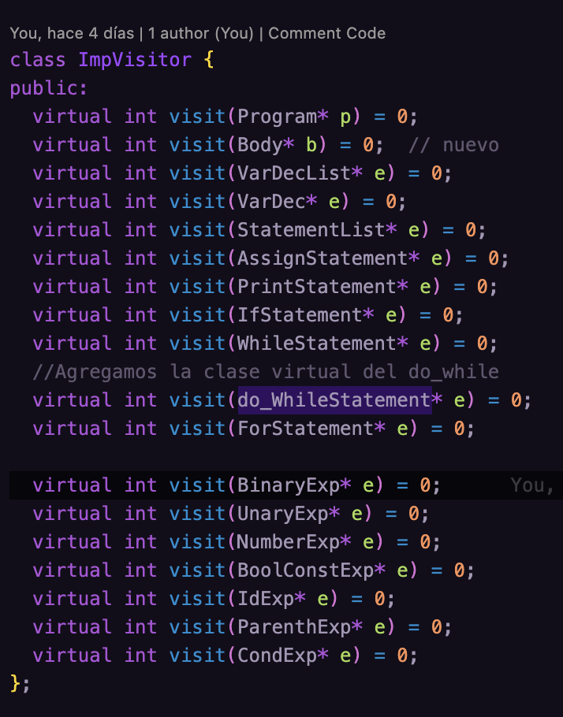</center>

En imp creamos el metodo do-while:
```cpp
class do_WhileStatement : public Stm{
public:
  Exp* cond;
  Body *body;
  do_WhileStatement(Exp* c, Body* b);
  int accept(ImpVisitor* v);
  void accept(TypeVisitor* v);
  ~do_WhileStatement();
};
```

Definicion del parser:
```
  Stm => ... | DoWhileStatement
  DoWhileStatement => "do" Body "while" Exp
```

Defincion del tchecker:

```
tcheck(env,DoWhileStatement(cond,body)) 
==>  tcheck(body) && tcheck(cond) == bool
```

Definicion del codegen:
```
codegen(addr,DoWhileStatement(cond,body)) 
==> l1: skip
    codegen(addr,body)
    codegen(addr,cond)
    jmpz l2
    goto l1
    l2: skip
```
## Pregunta 4 (Sentencias continue y break)

Se nos pide **Implementar las interpretaciones estándar de break y continue, las sentencias que permiten salir y terminar un loop o saltar a la condición de control del loop**

Además tenemos la siguiente directríz:
> Reporte: Indicar el cambio a la gramatica y los puntos donde se hicieron cambios al código. Además, proveer las definiciones de tcheck y codegen usadas

Por tanto estas son las modificaciones generadas:

1. Modificación al Scanner (imp_parser.cpp e imp_parser.hh)
Se han agregado las palabras reservadas ***continue*** y ***break*** con los tokens en el scanner tanto en el .cpp como en el .hh.
No olvidar que además se tuvo que modificar el límite de token_names

- En imp_parser.cpp
<center>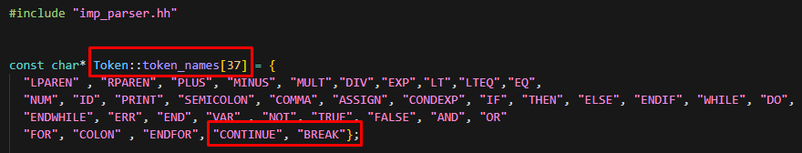</center>

<center>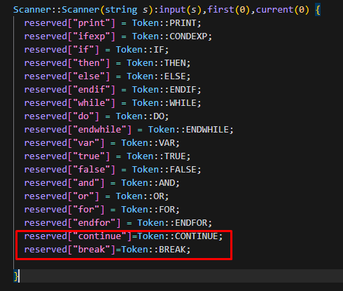</center>

- En imp_parser.hh
<center>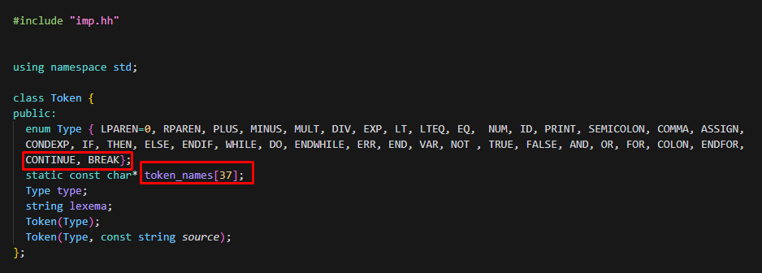</center>


2. Modificación del Parser (imp.hh)

- En imp.hh

<center>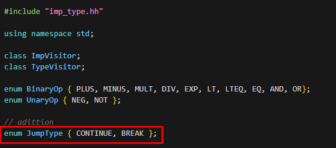</center>

<center>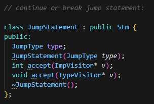</center>

La gramática fue modificada:


        Stm := ... | LoopSkipStatement;
        LoopSkipStatement :=> break | continue;


En la solución implementada arriba, la clase **JumpStatement** tiene un atributo *type* que indica si se trata de una instrucción ***continue*** o ***break***. Cuando se crea una instancia de **JumpStatement**, se especifica el tipo de salto que se desea representar. Luego, al llamar a los métodos *accept* del ***ImpVisitor*** y ***TypeVisitor***, se puede realizar el procesamiento correspondiente según el tipo de salto especificado en el atributo *type*. 

Lo anteriormente mencionado muestra la solución más simple al tener una única clase para manejar ambas funcionalidades de salto.